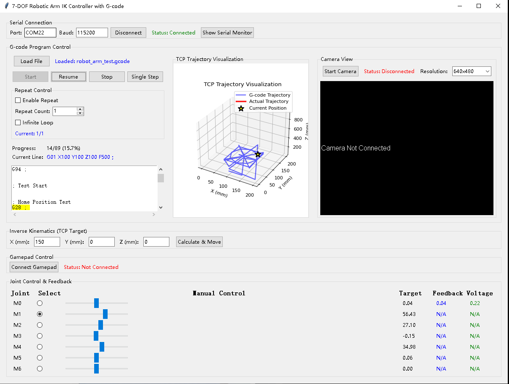

Introduction:
This is a modified 6-joint robotic arm, using an ESP32-based SimpleFOC driver board, an AS5047P magnetic encoder, and wireless communication.
Current Features:
Manual control (including mouse, keyboard, and joystick).
Automatic control (including GCode and visual recognition).
Remote control (using a Raspberry Pi as a server for remote operation).

This project provides a Python-based 7-DOF robotic arm control and demonstration system, including:
- Desktop GUI (PySide6) integration: motor control, trajectory display, and G-code processing
- G-code parsing and execution (supporting repeat/single-step/pause/stop)
- Inverse kinematics (IKPy) solving and serial transmission (ESP-NOW/serial port)
- Real-time feedback parsing and position waiting
- Optional legacy demo (Tkinter) application

This system is suitable for quickly verifying the motion path, communication link, and G-code workflow of a 7-axis robotic arm.

## Main Functions

- Motor Control
- Select "Real Joint" for secure transmission
- Feedback display (position/voltage), automatically cleared upon serial port disconnection
- G-code parsing and execution (G-code Processor/Widget)
- Preprocessing
- Supports G0/G1 (linear movement), G20/G21 (unit switching), G90/G91 (absolute/relative), G4 (pause), etc.
- Execution control: start, pause, stop, single step, repeat count, infinite loop
- Progress display, current line highlighting, trajectory display (matplotlib, optional)
- IK solver integration (IKPy), solving 7-axis joint angles based on X, Y, and Z
- Waiting for in-position: Based on motor 1 feedback (FB), with timeout protection and estimated wait fallback
- Inverse Kinematics (IK)
- Reuses `ikpy` link definitions, inputting X, Y, and Z = mm
- Use the previous solution as the initial value to improve convergence and stability
- Serial communication (Serial/ESP-NOW)
- Serial port management, connect/disconnect, and port refresh
- Parsing feedback format: "FB: motor_id, position, voltage"
- Sending protocol: 7 angles (degrees) multiplied by the gear ratio (default 50)

## Directory structure (excerpt)

- robotic_arm_modular/
- ui/main_window.py: Main window and module integration, serial UI, physical joint synchronization
- modules/
- motor_control.py: Motor control UI
- gcode_widget.py: G-code interface (OptimizedGCodeWidget)
- gcode_processor.py: G-code parsing/execution (OptimizedGCodeProcessor)
- ik_solver.py: IK solver (IKPySolver, based on ikpy)
- drag_programming.py: Graphics programming (placeholder/expandable)
- trajectory_display.py: Trajectory display (placeholder/expandable)
- utils/serial_comm.py: Serial port manager
- main.py: Application entry point (including main())
- serial_xyz_sender.py: Legacy Tkinter demo (including ikpy chain configuration, manual/handle/G-code demonstration)
- robot_arm_test.gcode: Sample G-code
- robotarm.PNG: Robotic arm image (referenced in the README)

## Quick Start

- Requirements
- Python 3.10+
- Dependencies: PySide6, ikpy, numpy, pyserial, matplotlib (optional, for trajectory display)

- Launch the GUI (PySide6 version)
- Run `robotic_arm_modular/main.py` to launch the main interface
- After connecting to the serial port, enter the "G-code" tab to load and execute G-code

- Legacy Demo (Tkinter Version)
- `serial_xyz_sender.py` is a standalone demo tool (including complete IK/G-code/controller/camera examples)
- Can be used for comparison or configuration migration

## Instructions (PySide6 GUI)

1. Connecting to the Serial Port
- Open the application → Select the port → Click "Connect"
- The status bar displays the connection status; disconnection automatically clears the feedback

2. Select "Physical Joint"
- The "Physical Joint" drop-down box at the top specifies which joints will be sent angles.
- Protect hardware: Unselected joints will be sent as 0

3. Loading and Executing G-code
- In the "G-code" tab → Click "Load File" and select .gcode/.nc/.tap/.txt
- Click "Start" to execute, with options for pause/stop/single-stepping
- You can select the number of repetitions or start an infinite loop
- If Matplotlib is installed, a 3D trajectory will be displayed on the right

4. IK Solving and Sending
- X, Y, and Z values ​​(units: mm) in G-code are solved for 7-axis joint angles (degrees) using IK.
- After converting to "motor axis angles" based on the gear ratio (default 50), they are sent as comma-separated lines.

## G-code Support (Excerpt)

- G0/G1: Linear moves, parsing X/Y/Z/F (units: mm; inches are converted to mm for G20)
- G2/G3: Arcs (currently simplified to linear moves)
- G4: Dwell/Hold
- G20/G21: Inches/Millimeters
- G90/G91: Absolute/Relative coordinates
- M0/M1: Dwell (basic)
- M2/M30: End of program

During execution, the current line is highlighted, progress is updated, and the trajectory display is synchronized (if available).

## Inverse Kinematics Description (ik_solver.py)

- Based on the `Chain + URDFLink` definition in `ikpy`, the default chain length is 150mm (0.15m) per segment.
- Target coordinate input units are millimeters (mm), which are automatically converted to meters (m) internally.
- Returns an 8-dimensional radian solution (including OriginLink). A [1:8] angle is taken and transformed before sending.
- If your actual link dimensions are different, adjust `link_length_m` in `IKPySolver._create_robot_arm()`.
- If there are discrepancies in the coordinate system/rotation axis, modify the `rotation` configuration of each `URDFLink` or perform axis mapping before sending.
