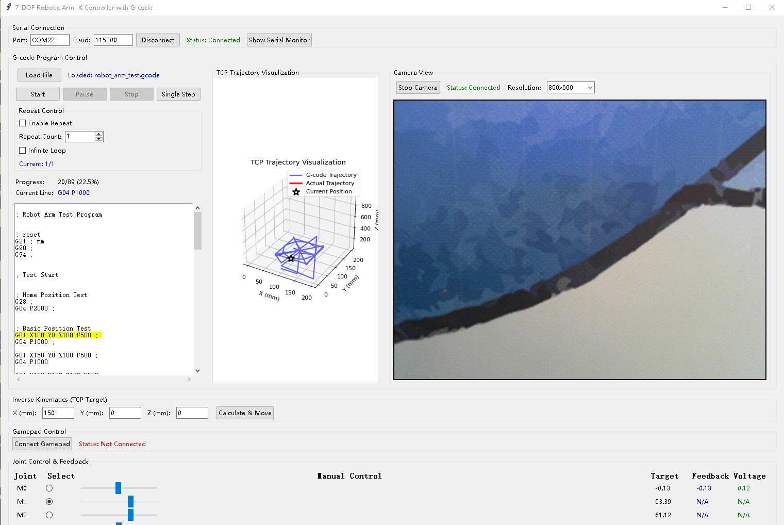

简介：

改造的6关节机械臂，使用ESP32主控的SimpleFOC驱动板，AS5047P磁编码，无线通讯

目前功能：

手动控制，包括鼠标，键盘，手柄
自动控制，包括gcode，视觉识别
远程控制，树莓派作为服务器，远程操控

# 7 关节机械臂控制系统（ESP-NOW/串口）

本项目提供一套基于 Python 的 7 自由度机械臂控制与演示系统，包含：
- 桌面 GUI（PySide6）集成：电机控制、轨迹显示、G-code 处理
- G-code 解析、执行（支持重复/单步/暂停/停止）
- 逆运动学（IKPy）求解与串口发送（ESP-NOW/串口）
- 实时反馈解析与到位等待
- 可选的遗留演示版（Tkinter）应用

该系统适用于快速验证 7 轴机械臂的运动路径、通信链路与 G-code 工作流。

## 主要功能

- 电机控制（Motor Control）
  - 选择“实物关节”安全发送
  - 反馈显示（位置/电压），串口断开自动清空
- G-code 解析与执行（G-code Processor/Widget）
  - 预处理
  - 支持 G0/G1（直线移动）、G20/G21（单位切换）、G90/G91（绝对/相对）、G4（停顿）等
  - 执行控制：开始、暂停、停止、单步、重复次数、无限循环
  - 进度显示、当前行高亮、轨迹显示（matplotlib，可选）
  - IK 求解器接入（IKPy），按 XYZ 求解 7 轴关节角
  - 到位等待：基于电机1反馈（FB），含超时保护与估算等待回退
- 逆运动学（IK）
  - 复用 `ikpy` 的链路定义，输入 XYZ 为毫米（mm）
  - 使用上次解作为初值，提升收敛与稳定性
- 串口通信（Serial/ESP-NOW）
  - 串口管理、连接/断开、端口刷新
  - 解析反馈格式：“FB: motor_id, position, voltage”
  - 发送协议：7 个角度（度）乘以齿轮比（默认 50）

## 目录结构（摘录）

- robotic_arm_modular/
  - ui/main_window.py：主窗口与模块集成、串口 UI、实物关节同步
  - modules/
    - motor_control.py：电机控制 UI
    - gcode_widget.py：G-code 界面（OptimizedGCodeWidget）
    - gcode_processor.py：G-code 解析/执行（OptimizedGCodeProcessor）
    - ik_solver.py：IK 求解器（IKPySolver，基于 ikpy）
    - drag_programming.py：图形编程（占位/可扩展）
    - trajectory_display.py：轨迹显示（占位/可扩展）
  - utils/serial_comm.py：串口管理器
  - main.py：应用入口（含 main()）
- serial_xyz_sender.py：遗留版 Tkinter Demo（含 ikpy 链配置、手动/手柄/G-code 演示）
- robot_arm_test.gcode：示例 G-code
- robotarm.PNG：机械臂图片（README 引用）

## 快速开始

- 环境要求
  - Python 3.10+
  - 依赖：PySide6、ikpy、numpy、pyserial、matplotlib（可选，用于轨迹显示）

- 启动 GUI（PySide6 版本）
  - 运行 `robotic_arm_modular/main.py` 启动主界面
  - 串口连接后，进入“G-code”标签页加载并执行 G-code

- 遗留演示（Tkinter 版本）
  - `serial_xyz_sender.py` 为独立的演示工具（含完整 IK/G-code/手柄/摄像头示例）
  - 可用于对比或迁移配置

## 使用说明（PySide6 GUI）

1. 连接串口
   - 打开应用 → 选择端口 → 点击“连接”
   - 状态栏显示连接状态；断连会自动清空反馈

2. 选择“实物关节”
   - 顶部“实物关节”下拉框用于指定当前仅对哪个关节发送角度
   - 保护硬件：未选中的关节发送 0

3. 加载并执行 G-code
   - 在“G-code”标签页 → 点击“加载文件”选择 .gcode/.nc/.tap/.txt
   - 点击“开始”执行，可暂停/停止/单步
   - 可选择重复次数或开启无限循环
   - 如安装 matplotlib，会在右侧显示 3D 轨迹

4. IK 求解与发送
   - G-code 中的 XYZ（单位：mm）会通过 IK 求解 7 轴关节角（度）
   - 按齿轮比（默认 50）转换为“电机轴角度”后，以逗号分隔并换行发送

## G-code 支持（节选）

- G0/G1：直线移动，解析 X/Y/Z/F（单位 mm，G20 时英寸会转换为 mm）
- G2/G3：圆弧（当前简化为直线移动执行）
- G4：停顿/保压
- G20/G21：英寸/毫米
- G90/G91：绝对/相对坐标
- M0/M1：暂停（基本）
- M2/M30：程序结束

执行期间将高亮当前行、更新进度，并同步轨迹显示（若可用）。

## 逆运动学说明（ik_solver.py）

- 基于 `ikpy` 的 `Chain + URDFLink` 定义，链长默认每段 150mm（0.15m）
- 目标坐标输入单位为毫米（mm），内部自动转换为米（m）
- 返回 8 维弧度解（含 OriginLink），发送前会取 [1:8] 并转角度
- 如你的实际连杆尺寸不同，请在 `IKPySolver._create_robot_arm()` 中调整 `link_length_m`
- 如坐标系/旋转轴有偏差，可修改各 `URDFLink` 的 `rotation` 配置或在发送前做轴映射

